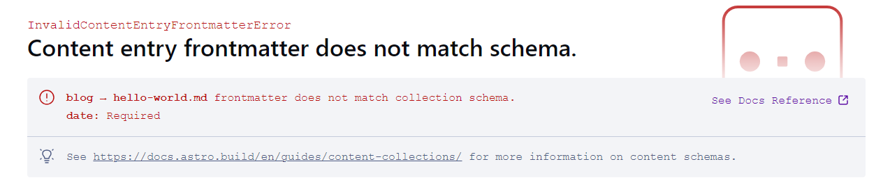

Back in January, Astro 2.0 was released with its new [Content Collections](https://astro.build/blog/astro-2/#automatic-type-safety-for-markdown--mdx). This new feature has made it easy to quickly add a blog to your website. Follow along in this article to see how I add a simple blog to my Astro site using this feature. At the end we will be able to write blog posts in markdown and then statically generate a page for each post.

**IMPORTANT NOTE**

This article is not going to walk you through how to setup Astro, or explain any of the existing components you see in the project. I plan to turn this into a series where we can explore these parts a bit more in depth.

---

## How It Works

There are three steps we need to follow in order to get the blog up and running

1. Define the content collection.
2. Build the content collection.
3. Render the content collection.

In the case of this article the content collection is a blog, but this feature could be used for anything.

## Activate Content Collections By Defining Your Collection

In order for Astro to know that we would like to use the content collections feature we must add a folder named **content** to our src folder.

After creating the **content** folder we will then create a **config.ts** file.

Here is what my folder structure looks like:

```markdown
├── src
│ ├── components
│ ├── content
│ │ ├── config.ts
│ ├── imgs
│ ├── layouts
│ ├── pages
```

### Why We Need To Config.ts

The config file is what makes Astro’s content collections so special. In this file we will explicitly define the shape of the data for each of our collections. In this example since we are building a blog, we are defining the frontmatter that we want our markdown files to follow. Astro will then alert us if we create a new blog post that doesn’t fit our configuration.

Here is my config file:

```tsx
import { z, defineCollection } from 'astro:content'

const blogCollection = defineCollection({
	type: 'content',
	schema: z.object({
		title: z.string(),
		description: z.string(),
		date: z.date()
	})
})

export const collections = {
	blog: blogCollection
}
```

_`import_ { z, defineCollection } _from_ 'astro:content'`

First we need to call in zod and the `defineCollection` helper function.

**IMPORTANT NOTE**

You will likely get an error saying that “astro:content” can’t be found. Ignore this for now as we will fix this later.

```tsx
const blogCollection = defineCollection({
	type: 'content',
	schema: z.object({
		title: z.string(),
		description: z.string(),
		date: z.date()
	})
})
```

Next, it is time to define the shape of the data that our collection will follow. The z object has a bunch of methods off of it that allow you to specify the restrictions for our blog collection. For example, if you didn’t want the title to be longer than 60 characters so that it follows SEO best practices, you could change `title: z.string()` to `z.string().max(60)`.

```tsx
export const collections = {
	blog: blogCollection
}
```

Finally, we export a collections object with the key blog that points to our newly defined collection. It is important to note that the name of the key is very important, as this is the folder that Astro will look for. If we changed `blog: blogCollection` to `post: blogCollection` then Astro would only do the type checking of the frontmatter of markdown files in the post folder.

Now that we have defined our content collection, Astro knows where to look and what types to enforce, it is time to actually build some content.

## Build Our First Post

Create a new folder called **_blog_** in the content folder. If you exported a different key name in the previous step then swap **blog** for that key instead.

Inside our new **blog** folder I am going to put my first blog post, so I create a start-a-blog-with-astro.md file and place all this content I am writing in there.

Here is what the folder structure now looks like:

```tsx
├── src
│   ├── components
│   ├── content
|   |   ├── blog
|   |   |   ├── start-a-blog-with-astro.md
│   │   ├── config.ts
│   ├── imgs
│   ├── layouts
│   ├── pages
```

Here is what the markdown file looks like

```markdown
---
title: Start A Blog With Astro
description: This is my approach to building a developer blog using Astro.
date: 2023-11-09
---

Back in January, Astro 2.0 was released with its new Content Collections. This new feature has made it easy to quickly add a blog to your website. Follow along in this article to see how I add a simple blog to my Astro site using this feature. At the end we will be able to write blog posts in markdown and then statically generate a page for each post.
```

Once we have added this folder and file we will want to terminate our server and run `npm run dev` again. Astro will now detect the match between folder name and content collection and generate types. This will also make “astro:content” available.

You can see that the frontmatter matches the `blogCollection` schema that we defined earlier. While VS code won’t be able to alert you when your schema doesn’t match in the editor, Astro will alert you once your try to render that markdown file and the frontmatter doesn’t match the defined schema.

### Problems To Watch Out For

From my experience there is a very high likely hood that you can run into the following problem.

**Cannot find module Astro:Content or it’s corresponding type definitions**

Anytime you run `npm run dev`, Astro will read your config.ts file and generate type definitions for your content collections. This only works if you have a folder for that content collection with a file inside it. If you are getting this error try the following solutions:

- Make sure everything we have touched so far is in the content folder.
- Make sure that the key that points to your collection matches the folder name you are storing the content in.
  - Also make sure there is at least one file in this folder!
- Try reloading the Astro.
- Rerun npm run dev.
- Close and reopen vscode.

## Render Your Blog Posts

Astro also makes it super easy to grab all of our blog posts. From there we can do a lot.

- Pull featured posts into a blog section on our homepage.
- Generate a page for each blog post (ssg, or ssr)
- Create an archive page to list all of our posts

This tutorial will end with showing you how I quickly rendered out my blog posts to their own page.

First, I created a new folder called blog under the pages folder. Then I created an Astro file called […slug].astro which will be responsible for telling Astro to generate a page for each of the markdown files we have in our content collection.

```markdown
├── src
│ ├── components
│ ├── content
| | ├── blog
| | | ├── start-a-blog-with-astro.md
│ │ ├── config.ts
│ ├── imgs
│ ├── layouts
│ ├── pages
│ │ ├── blog
| | | ├── [...slug].astro
```

This is the code I have inside […slug].astro:

```tsx
---
import type { InferGetStaticPropsType } from 'astro'
import { getCollection } from 'astro:content'
import CoreLayout from '~/layouts/CoreLayout.astro'
import formatDate from '~/lib/formatDate'

export async function getStaticPaths() {
	const blogEntries = await getCollection('blog')
	return blogEntries.map((entry) => ({
		params: { slug: entry.slug },
		props: { entry }
	}))
}

type Props = InferGetStaticPropsType<typeof getStaticPaths>
const { entry } = Astro.props
const { Content } = await entry.render()
---

<CoreLayout
	seo={{ title: entry.data.title + ' | Clayton Schneider', description: entry.data.description }}
>
	<section class="px-4 pt-32">
		<div class="mx-auto max-w-2xl">
			<h1 class="text-3xl font-bold">{entry.data.title}</h1>
			<p class="mt-2">{formatDate(entry.data.date)}</p>

			<div class="prose mt-5">
				<Content />
			</div>
		</div>
	</section>
</CoreLayout>
```

In order to generate a page for each of our posts we need to give Astro some information. We need to tell which files we are building a page for, what their slug should be, and what those pages should look like.

To start, we need to export `getStaticPaths()`. Astro will generate a page for each value in the array we return.

`const blogEntries = await getCollection('blog')`

To build this array we need to fetch all of our posts. The above code does just that, `getCollection` is a helper function that will retrieve all of the content in a specific content collection, in our case the blog content collection we defined in step one.

When we map over our blog posts we build an object that Astro will use for building the page. We define what the url slug should be and then we pass the entire blog post object as a prop so that we can use it in the rest of the file.

You might wonder where the slug parameter comes from since we never defined that in our schema. Astro automatically generates a slug value for each file in a content collection.

`type Props = InferGetStaticPropsType<typeof getStaticPaths>`

When we pass the blog entry from `getStaticPaths` to props we end up losing its type definition. To make sure that we get TypeScript autocomplete we need this above line.

Astro also conveniently has a render method that we can call on entry to convert from markdown into HTML. This allows us to simply drop Content in as a component in our blog template.

Now when you visit /blog/your-new-blog-post, you will see the contents of your markdown file, very exciting!

**IMPORTANT NOTE**

If you change the schema in config.ts for your content collection then make sure to rerun `npm run dev`. Also be sure to update all of your files in that collection. If you visit your page or build your site without updating Astro will give you an error.




## Closing Thoughts

There is a lot more I want to do to make my blog better, but this is a good start. I will be turning this into a series where I will document how I add more features to strengthen the blog. Some ideas include:

- How to add a draft mode so that works in progress are not built
- How to build an archive with pagination
- How to transfer from md to mdx so we can add custom components
